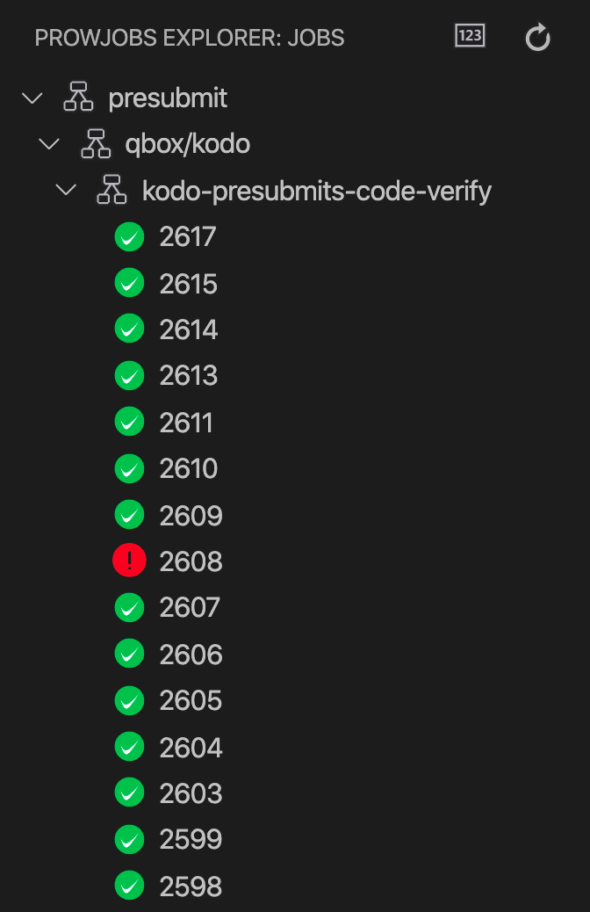
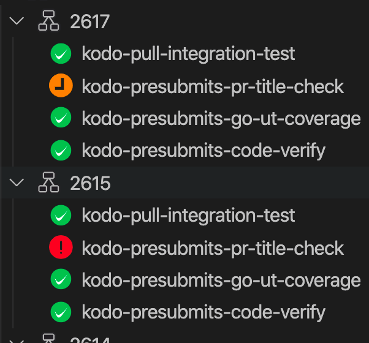
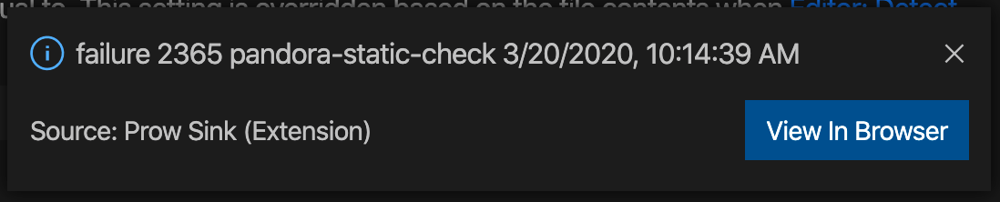

# prow-sink README

This is a configurable tool for Kubernetes Prow CI.

## Features

- View prow jobs' latest state in tree view

You can view all pull requests history of one prow job,

and view all prow jobs of one pull request.

- Notification of latest prow jobs' state

## Configurations

You can configure several settings for this extension (Prow Jobs).

- Server Url
- Focused Jobs
- Focused Repos

Without `server url`, this extension won't work. Prow jobs of `focused jobs` and `focused repos` will be shown in tree view and notified.